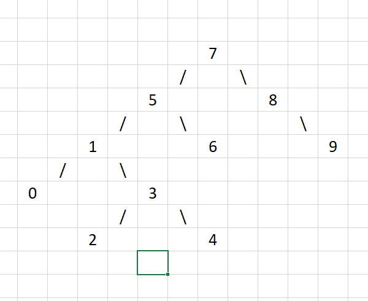

# Veri Yapıları ve Algoritmalar
## Proje 1

[22,27,16,2,18,6] -> Insertion Sort

### Soru 1
- [16,27,22,2,18,6]
- [2,27,22,16,18,6]
- [2,22,27,16,18,6]
- [2,16,27,22,18,6]
- [2,6,27,22,18,16]
- [2,6,22,27,18,16]
- [2,6,18,27,22,16]
- [2,6,16,27,22,18]
- [2,6,16,27,22,18]
- [2,6,16,22,27,18]
- [2,6,16,18,27,22]
- [2,6,16,18,22,27]

### Soru 2
O(log6) => 2^x = 6

### Soru 3
Average Case: 16 - 18
Worst Case: 27
Best Case: 2

### Soru 4
Average Case

[7,3,5,8,2,9,4,15,6] dizisinin Insertion Sort'a göre ilk 4 adımını yazınız.

- [3,7,5,8,2,9,4,15,6]
- [2,7,5,8,3,9,4,15,6]
- [2,5,3,8,3,9,4,15,6]
- [2,3,5,8,3,9,4,15,6]

## Proje 2

[16,21,11,8,12,22] -> Merge Sort

### Soru 1

- [16,21,11] - [8,12,22]
- [16] - [21,11] - [8] - [12,22]
- [11,16,21] - [8,12,22]
- [8,11,12,16,21,22]

 ### Soru 2
 
 O(6Log6)

 ## Proje 3
 
 ### Soru 1
 
 
